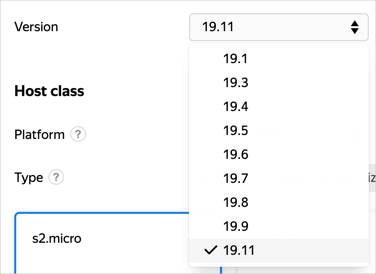

# Changing {{ CH }} versions

You can change the {{ CH }} version that the cluster uses. You can view a list of available versions on the create and modify cluster screen in the management console.



## Before changing versions {#before-update}

Before changing the {{ CH }} version, make sure this doesn't affect your apps:

1. See the {{ CH }} [changelog](https://github.com/yandex/clickhouse/blob/master/CHANGELOG_RU.md) and check which updates may affect how apps function.
1. Try changing versions on a test cluster (you can try deploying it from a backup of the main cluster). Please note that when you deploy a cluster from a backup, only MergeTree engine tables are recovered.
1. [Make a backup](cluster-backups.md#create-backup) of the main cluster before changing the version.

## Changing the version {#start-update}

To change the {{ CH }} version:



- Management console
  1. Open the **Managed Service for {{ CH }}** page in the folder where you want to change the {{ CH }} version.
  1. In the list of clusters, select the one to change.
  1. Click **Edit cluster**.
  1. In the **Version** field, select the version.
  1. Click **Save changes**.

  When the change starts, the cluster status switches to `UPDATING`. Wait for the operation to complete and then check the cluster version.

- CLI

  1. Get a list of your {{ CH }} clusters:

     ```
     $ yc managed-clickhouse cluster list
     +----------------------+---------------+---------------------+--------+---------+
     |          ID          |     NAME      |     CREATED AT      | HEALTH | STATUS  |
     +----------------------+---------------+---------------------+--------+---------+
     | c9q8p8j2gaih8iti42mh | clickhouse691 | 2019-04-23 12:44:17 | ALIVE  | RUNNING |
     +----------------------+---------------+---------------------+--------+---------+
     ```

  1. Get information about a cluster and check the {{ CH }} version in your cluster in the `config.version` parameter:

     ```
     $ yc managed-clickhouse cluster get c9q8p8j2gaih8iti42mh
     id: c9q8p8j2gaih8iti42mh
     folder_id: b1gqs1teo2q2a4vnmi2t
     created_at: "2019-04-23T12:44:17.929853Z"
     name: clickhouse691
     environment: PRODUCTION
     monitoring:
     - name: Console
       description: Console charts
       link: https://console.cloud.yandex.ru/folders/b1gqs1teo2q2a4vnmi2t/managed-clickhouse/cluster/c9q8p8j2gaih8iti42mh?section=monitoring
     config:
       version: "19.1"
       ...
     ```

  1. Execute the version change {{ CH }}:

     ```
     $ yc managed-clickhouse cluster update --id c9q8p8j2gaih8iti42mh --version 19.4
     ```

     When the change starts, the cluster status switches to `UPDATING`. Wait for the operation to complete and then check the cluster version.

- API

  You can change the {{ CH }} version for a cluster using the [update](../api-ref/Cluster/update.md) API method: pass the appropriate value in the `configSpec.clickhouse.config.version` request parameter.



